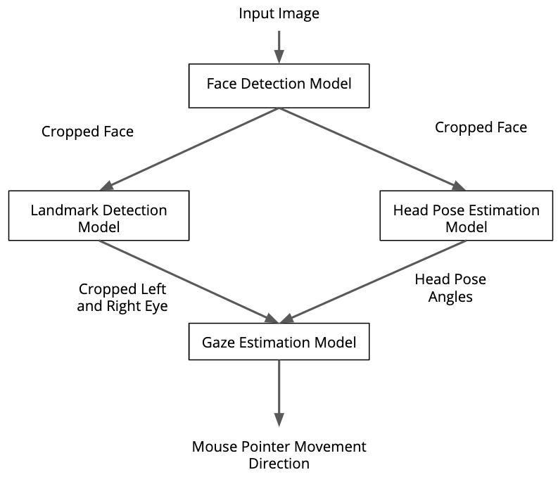

# Computer Pointer Controller

This is the last Project in order to obtain the Intel Edge AI Nanodegree from Udacity, the objective is to create an application capable of moving the computer pointer using only the movement from the head and eyes.

[](https://www.youtube.com/watch?v=pDGPJJVS2jE&t)

 This involves many considerations:

* We need several models working together, each one covering a needed functionality. For example, a face detection model is used to feed a face landmarks model.
* We need to control the application logic to create an optimal flow, as the models involved could use a lot of resources.
* Regarding the models themselves, it could be interesting to check if we could use different precisions models in order to gain more performance.

In general, the flow looks like this:

<p align="center">

</p>

The application uses gaze detection points with the use of deep learning model to estimate the gaze of user's eyes to move the mouse pointer position. It supports camera video stream and video file as input.


## Project Set Up and Installation
OpenVINO™ toolkit and its dependencies must be installed to run the application. OpenVINO 2020.2.130 is used on this project. 
 
 Installation instructions may be found at:
 * https://software.intel.com/en-us/articles/OpenVINO-Install-Linux 
 * https://github.com/udacity/nd131-openvino-fundamentals-project-starter/blob/master/linux-setup.md  

Create and configure a Python Virtual Environment
This is recommended as a good practice. This project assumes you have Python>=3.6.9, if not, please check the related [documentation](https://www.python.org/downloads/).

Having Python installed, create a virtual environment running the following shell command:

```
python3 -m venv <your-env>
```

Activate it by running:

```
source your-env/bin/activate
```

There are certain pretrained models you need to download after initializing the openVINO environment:

`source /opt/intel/openvino/bin/setupvars.sh`
-   [Face Detection Model](https://docs.openvinotoolkit.org/latest/_models_intel_face_detection_adas_binary_0001_description_face_detection_adas_binary_0001.html)
-   [Facial Landmarks Detection Model](https://docs.openvinotoolkit.org/latest/_models_intel_landmarks_regression_retail_0009_description_landmarks_regression_retail_0009.html)
-   [Head Pose Estimation Model](https://docs.openvinotoolkit.org/latest/_models_intel_head_pose_estimation_adas_0001_description_head_pose_estimation_adas_0001.html)
-   [Gaze Estimation Model](https://docs.openvinotoolkit.org/latest/_models_intel_gaze_estimation_adas_0002_description_gaze_estimation_adas_0002.html)

To download the above pretrained model, run the following commands after creating `model folder` in the project directory and `cd` into it:

*Face Detection*

```
$ python3 /opt/intel/openvino/deployment_tools/tools/model_downloader/downloader.py --name "face-detection-adas-binary-0001"
```

*Head Pose Estimation*

```
$ python3 /opt/intel/openvino/deployment_tools/tools/model_downloader/downloader.py --name "head-pose-estimation-adas-0001"
```

*Gaze Estimation Model*

```
$ python3 /opt/intel/openvino/deployment_tools/tools/model_downloader/downloader.py --name "gaze-estimation-adas-0002"
```

*Facial Landmarks Detection*

```
$ python3 /opt/intel/openvino/deployment_tools/tools/model_downloader/downloader.py --name "landmarks-regression-retail-0009"
```

## Demo
Use the following command to run the application

```
python3 src/main.py -i 'bin/demo.mp4' -fld 'models/intel/landmarks-regression-retail-0009/FP16/landmarks-regression-retail-0009.xml' -fd 'models/intel/face-detection-adas-binary-0001/FP32-INT1/face-detection-adas-binary-0001.xml' -ge 'models/intel/gaze-estimation-adas-0002/FP16/gaze-estimation-adas-0002.xml' -hp 'models/intel/head-pose-estimation-adas-0001/FP16/head-pose-estimation-adas-0001.xml' 
```

## Documentation

command line parameters
```
$ python3 main.py --help
usage: main.py [-h] -fd FACE_DETECTION_MODEL -fld FACIAL_LANDMARK_MODEL -ge
               GAZE_ESTIMATION_MODEL -hp HEAD_POSE_MODEL -i INPUT
               [-l CPU_EXTENSION] [-prob PROB_THRESHOLD] [-d DEVICE]
               [-v VISUALIZATION]


## Benchmarks
Measuring performance (Start inference asyncronously, 4 inference requests using 4 streams for CPU, limits: 60000 ms duration)

Hardware Configuration: Intel® Core™ i5-6200U CPU @ 2.30GHz × 4

_______________________________________
*face-detection-adas-binary-0001*

*FP32*

* Count: 5320 iterations
* Duration: 60037.26 ms
* Latency: 42.58 ms
* Throughput: 88.61 FPS

____________________________________
*gaze-estimation-adas-0002*

*FP16-INT8*
* Count: 78160 iterations
* Duration: 60002.77 ms
* Latency: 2.89 ms
* Throughput: 1302.61 FPS

*FP16*
* Count:  51312 iterations
* Duration: 60007.48 ms
* Latency: 4.43 ms
* Throughput: 855.09 FPS

*FP32*
* Count: 48736 iterations
* Duration: 60007.04 ms
* Latency: 4.48 ms
* Throughput: 812.17 FPS

________________________________________
*head-pose-estimation-adas-0001*

*FP16*
* Count:  62812 iterations
* Duration: 60004.12 ms
* Latency: 3.55 ms
* Throughput: 1046.79 FPS

*FP16-INT8*
* Count:  81888 iterations
* Duration: 60004.36 ms
* Latency: 2.79 ms
* Throughput: 1364.70 FPS

*FP32*
* Count: 55084 iterations
* Duration: 60005.58 ms
* Latency: 3.63 ms
* Throughput: 917.98 FPS

___________________________________________
*landmarks-regression-retail-0009*

*FP16*
* Count:  335108 iterations
* Duration: 60001.13 ms
* Latency: 0.68 ms
* Throughput: 5585.03 FPS

*FP16-INT8*
* Count:  295848 iterations
* Duration: 60000.93 ms
* Latency: 0.72 ms
* Throughput: 4930.72 FPS

*FP32*
* Count: 322800 iterations
* Duration: 60000.69 ms
* Latency:  0.67 ms
* Throughput: 5379.94 FPS
________________________________________________

## Results
From the above results, the best model precision combination is that of Face detection 32 bits precision with other models in 16 bits. 
This reduce the model size and load time, although models with lower precision gives low accuracy but better inference time.

In this case, both model precisions tested had around the same performance. what is remarkably is that the face detection model is, by far, the most expensive computationally speaking, representing around 50% of all the inference time taken per frame.

In order to improve the application, it is suggested to check if there is another available face detection model that could reach similar performance, because at this point the biggest issue is the time taken for this model.

Regarding accuracy, it wasn't observed big differences between FP32 and FP16 models. This could be relevant because with FP16 models we can use hardware accelerators like VPUs without worrying about accuracy loss.


### Async Inference
If you have used Async Inference in your code, benchmark the results and explain its effects on power and performance of your project.

## Author

Tomiwa Adedokun.